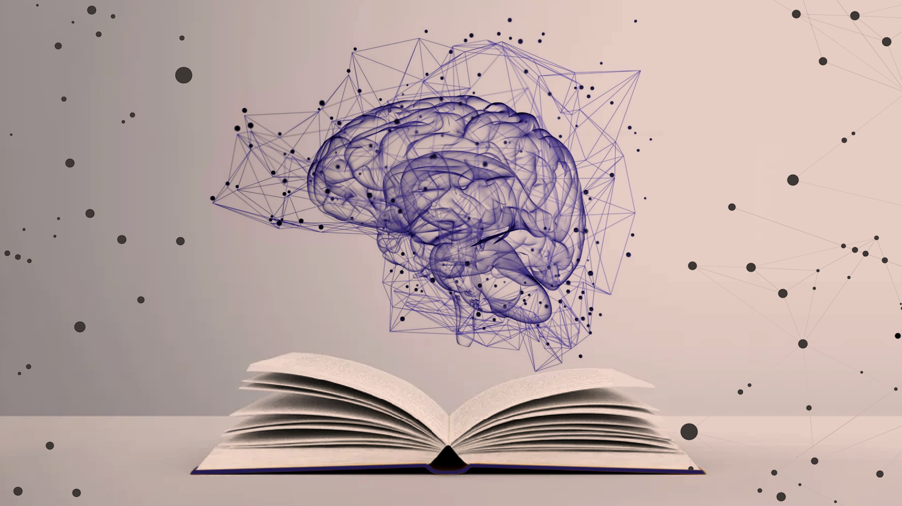
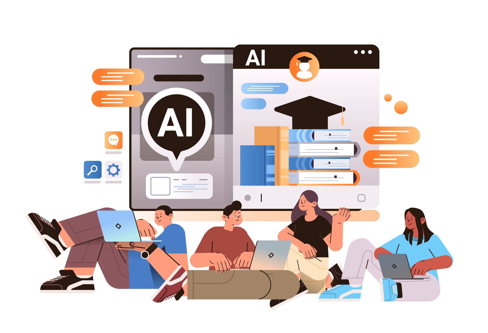

## Table of Contents
1. [Introduction](#i-the-rise-of-ai-in-education)
2. [Personal Experience with AI](#ii-getting-with-the-times)
3. [Impact on Learning and Understanding](#iii-code-faster--but-at-what-cost)
4. [Practical Applications](#iv-ai-in-the-real-world)
5. [Challenges and Opportunities](#v-redefine-learning)
6. [Comparative Analysis](#vi-classroom-companions-or-distractions)
7. [Future Considerations](#vii-better-integration-better-engineers)
8. [Conclusion](#viii-what-now)

## I. The rise of AI in education
With the rapid spread and development of generative artificial intelligence (AI), its adoption in various fields are unsurprising. One such field—education—has felt the drastic effects of generative AI, shifting the landscape of education altogether. In the modern day, students have become reliant on AI to complete various assignments while professors may use it to grade work, send emails, or even prepare lesson plans and entire syllabi.

In the context of software engineering (and programming in general), AI has—for better or worse—diminished the incentive for writing code in lieu of a new type of engineering: _prompt engineering_. Rather than honing fundamental skills and absorbing materials, some students may find themselves learning how to communicate with AI companions to generate outputs they deem sufficient for an assignment, project, or report. As my software engineering professor graciously stated, 

> _"Using AI doesn’t remove the problem of coding, it only moves it around" **—Brook Conner**_

This could not be more true, as with prompt engineering, students may become less focused on key concepts but laser-focused on quickly getting AI to generate outputs that work with fewer prompts. 

## II. Getting with the times
Within my software engineering course, I have been introduced to various AI companions (GitHub Co-Pilot, ChatGPT, Google’s Gemini) but consciously attempt to minimize my use. This is primarily because I am a firm believer in “muscle memory” and the principle of “practice makes perfect”. This is to say that I believe consistent, repetitive exercises are one of, if not the most, effective ways to learn and improve skills. In the world of programming (and the software engineering course), this came in the form of quick-timed implementations, "workouts-of-the-day" or _WODs_, as well as multiple coding and non-coding assignments, projects, and more. However, I have found myself knowingly and unknowingly using AI tools. For brevity, I have condensed my experiences in a list:

1. **Experience WODs** - These WODs are homework assignments involving certain software engineering concepts. Due to the nature of the environment and expanded time frame, **I preferred not using AI**. Instead, I would simply use online resources and scour sites like StackOverflow or GitHub forums if I ever ran into any issues. This helped me conserve the mindset of actively searching for a problem instead of expecting one immediately.

2. **In-class Practice WODs** - These practice WODs were not totally stress-inducing and covered important programming/engineering concepts used. _I had the foresight to avoid looking for answers with AI_ in these cases and stick to material I deemed “official” (i.e. class readings, previously completed WODs, or official documentation), which allowed me to absorb the material better—albeit at the cost of speed whilst coding.

3. **In-class WODs** - Since in-class WODs were graded and under certain time limits, I found myself succumbing to the pressure of pushing out work fast. Instead of diligently looking for specific sources, I recall viewing the first result on Google—which so happened to be Google’s Gemini AI companion. So in these cases, **I end up sometimes relying on AI companions** in order to find a quick fix or brief summaries of concepts I may have not fully grasped or have forgotten. Many of these “prompts” occur in the Google search bar and are accordingly written as such (i.e., “how to center content vertically html react-boostrap”, “upload images to supabase database in react client”, etc.). These searches also normally spout code that I look at as a reference or actual links into websites that I will follow for more information.

4. **Essays** - **I have not and will not AI to write essays at all.** This is a personal gripe I have always had and my *personal opinion*: using AI to write essays feels cheap and unreasonable. Some people may cite time issues which can be argued as fair, but I believe in taking the time to personally write out essays as it is a reflection of the author—how they think, comprehend, and communicate certain concepts. Using AI to refine or word sections better is understandable but cannot be used as an entire substitute for human writing, an important skill to exercise.

5. **Final Project** - For the final project (a fully deployed website using Vercel, Supabase, and a NextJS template), **I have relied on AI**, mainly ChatGPT, for various implementations and structural implementations. Though I have attempted to generate technical implementations for the final project, I found that the effort put into merging the implementation was larger (and more frustrating) than simply learning the implementation myself. Since then, my workflow usually follows:
    - Prompting questions with contexts (i.e., “[context about project/desired product]. How would I [technical details of desired implementation])
    - Skimming through the code for a general idea
    - Finding tutorials/documentation/examples by other people
    - Learning and implementing function myself
    - Reviewing code to fine-tune my understanding of its implementation

6. **Learning a Concept/Tutorial** - **I have used AI** (again, mostly ChatGPT) to explain certain concepts to me if I find them confusing. These are usually in the scale of large, overarching lessons with multiple parts rather than a single basic tutorial/lesson. These prompts simply ask the AI companion to explain the desired subject, with follow-up prompts to validate my understanding or inquire further (“So [my understanding/interpretation], is that right?”, “What about [X, Y, Z]?”). I think this method of double-checking and inquiring rather than immediately asking for answers helps retain some critical thinking ability.

7. **Answering a Question in Class or in Discord**- I primarily attempt using “official” or accredited sources, prior knowledge, and diligent research before answering questions in-class or Discord, **so no AI used here**. Though it may require more effort and research, it would be _my answer_, there is no sense asking AI since it essentially turns me into a middle man.

8. **Asking or Answering a Smart-Question** - Similarly, **I have not used AI** to ask a smart-question because I feel as if feeding my question through AI would not convey my current understanding.

9. **Coding Example** - **I have unintentionally done this using the Google Gemini AI** but instead of explicitly asking for examples, I am asking for a broader implementation that ends up generating a code example instead. This typically occurs during moments where I am feeling too frustrated or lazy to do my own research, which can be detrimental if I let it become the sole method of finding answers.

10. **Explaining Code** - **My main purpose of using AI to explain code is usually for debugging purposes, and in turn, explaining code.** I personally think this is one of the more convenient and good applications of AI in coding as it saves the hassle of digging through forums and pages for niche errors that may be distinct to the programmer and their coding environment. This debugging process normally involves highlighting some error messages (in command-line interface or the integrated development environment and asking Co-Pilot to explain the code).

11. **Writing Code** - As I have mentioned, **I have attempted to use AI to write code but do not find it usable in practice for large-scale projects**. When it involves smaller functions with _unfamiliar APIs_, I have greater success using prompts in the same format (context then question). Additionally, the autocomplete feature from GitHub Co-Pilot speeds up the development process a lot when writing code, though some minor changes have to be made to ensure specific functionalities.

12. **Documenting Code** - **Not an application I have explicitly considered, so I have not used AI for this.** I also think it’s important that programmers and engineers are able to read code and comprehend it well enough to create their own documentation.

13. **Quality Assurance** - Similar to ‘explaining code’, **I think using AI for quality assurance is totally understandable and even a ‘good’ use case**. Not only can I leverage the vast amounts of clean, refined code that these chatbots are trained on, but I can also save the hassle of digging for environment-specific issues since the chatbot will do it for me. Of course not every suggestion/fix works, but it gives me a good idea of the problem I am attempting to fix.

14. **Other Uses in a Software Engineering Course** - A use case I could imagine not listed here includes using AI to summarize certain readings or videos under time constraints. **I have not done so** but believe it is a possibility, in which students may be unable to fully read through certain materials or watch through videos and resort to AI to summarize such ideas. Since it is mainly for comprehension, I do not find this use totally detrimental nor egregious.

15. **Other Uses Not Listed** - This list generally covers the various use cases I have encountered with AI in my academic experience, not just my software engineering course. However, **I have used AI in much more mundane ways**: helping me come up with ideas for trivial things (picture ideas, Instagram posts), or rewriting emails to make them sound friendlier (as I’ve been told that I can come across as too blunt and/or robotic). I find these uses less detrimental because they are trivial in nature and examples I can learn from—re-reading emails that sound “friendlier” helps me understand writing patterns that are considered friendly, whilst reading ideas give me a good ‘jumping off point’ for brainstorming sessions.

## III. Code faster ... but at what cost?
From these experiences, I believe that I have established a firm stance on generative AI: _it can be convenient when used properly but not the answer for every solution_. Personally, I see myself as neither stuck in traditional engineering methods nor exaggerating the impact of AI.

As someone who has come around to using AI more while still trying to maintain fundamental engineering skills, my learning experience with AI is honestly a mixed bag. There are moments where I find myself proud of being able to grasp software engineering concepts without opening up a chatbot and there are other times when it feels like I am so lost, I have no choice but to open up a chatbot to get started. 

Specifically, **problem-solving abilities/critical thinking seem to suffer the most due to the prevalence of AI**, whilst comprehension and skill development are more dependent on the user. To elaborate, AI chatbots directly strip the need to critically think through problems since students can simply prompt a chatbot and expect an answer, deteriorating their problem-solving skills and possibly comprehension. 

**However, AI may bolster comprehension and skill development** _if used properly_. If students used AI to break problems down or rephrase them for better comprehension, while actively reading, writing, and understanding code generated, then comprehension and skill development can still be sustained or even developed at a faster pace. I have personally felt such effects of the different use cases, where I felt my practical skills deteriorate over a long period of time when being over reliant on chatbots for immediate results, versus feeling more confident in my understanding of software engineering capabilities when taking time to use AI to facilitate problem comprehension and actively practicing technical skills.

## IV. AI in the real world

Outside education, AI has been applied in almost every aspect of technology. This has generated new possibilities for real-world software engineering. For example, capabilities like facial recognition are developed further thanks to new AI algorithms analyzing captured data and continually improving recognition abilities for various environments.

Another example includes **federated learning**, which refers to an AI framework that decentralizes training data, maintaining privacy and security. This essentially uses client nodes to train a model, while the newly found parameters/gradients are aggregated by a server to update an overall model. With this application of AI, data is no longer kept in a single database, expanding the points of failure possible and boosting security altogether. Additionally, this method allows **collaborative learning**, where institutions can jointly train a model with extra capabilities without risking data leaks.

From these examples, both advancements and applications of AI are shown to offer new solutions and capabilities in the world of software engineering. However, this also comes with many ethical issues and an entirely new realm of cybersecurity concerns based on AI usage by malicious parties.

## V. Redefining learning
**Similarly, the challenges and opportunities made possible by AI are also present in the classroom.** Throughout my software engineering course, I have experienced a learning curve of sorts to better work with AI companions. Some challenges I have challenged include **effective prompting** and **validating the results generated**. At the beginning of the course, I assumed that using AI simply entailed a basic prompt akin to a 'Google search' and blindly accepting the results it generated---which was how I first used AI companions. Instead, I immediately learned that blindly doing so would lead to subpar results. Thus, it is important for students to learn a high-level understanding of how AI chatbot companions work to create prompts that yield optimal results, in addition to learning to be diligent with the answers posed by AI.

However, these challenges come with opportunities to further integrate AI in software engineering courses, especially since many applications now use AI for some feature in their software, workflow, or analysis. New lessons in not just learning how to use AI in a disciplined manner to optimize learnings, but also lessons dedicated to implementing features made possible by AI would help new software engineers be better prepared for a job market inundated with AI features.

## VI. Classroom companions or distractions?
With the discussion of AI challenges/opportunities in the classroom, it is also important to analyze the balance between sticking with traditional methods and embracing newer technology. Of course, extreme ideologies like solely using traditional teaching methods or completely ditching conventional software engineering concepts in favor of AI would yield catastrophic results. Instead, we can consider metrics like engagement, knowledge retention, and practical skill development when it comes to assessing different teaching methods.

1. **Engagement** - One can argue that traditional teaching methods outclass integrations of AI. Outside demonstrating AI applications, teaching software engineering through traditional lectures, explanations, and hands-on skills will likely induce more active engagement than generic AI prompting. For example, I find myself much more focused on lessons when listening to a professor's video lecture, or following a guide on implementing some software rather than reading through/using AI-assisted tools, specifically since AI chatbots feel much more direct, straightforward, and too akin to a 'Google search' than an actual lesson being taught.

2. **Knowledge Retention** - Moreover, knowledge retention serves to be bolstered through conventional teaching methods in software engineering. Similar to the previous point for engagement, attempting to integrate AI into knowledge retentions techniques appears difficult and limited since it does not employ any distinct or creative strategies that other experiences might. WODs, for instance, are fantastic for knowledge retention because it helps students exercise critical thinking skills and develops muscle memory when it comes to coding. That being said, knowledge retention can still be aided with AI-enhanced approaches since it can offer additional methods personalized for students that learn differently. Implementing AI may also help students retain knowledge by simplifying complex, intricate concepts into core concepts that may be considered easier to remember.

3. **Practical Skill Development** - Development of practical skill is the metric where AI-enhanced methods seem the most beneficial. Though this is primarily dependent on students, instructor guidance can teach students how to effectively use AI to their advantage with effective prompting and disciplined application outside copying and pasting code. The software engineering course I took already had a good beginning of implementing AI by making its use less taboo and encouraging students to use it when appropriate, but I believe that it can be taken a step further by teaching students how AI is used practically outside of education and how to properly balance it with traditional skill development techniques.

## VII. Better integration, better engineers
Throughout this essay, I have reiterated that AI does have a place in learning, but needs to be better integrated into ongoing tech-related courses (like software engineering) to ensure that students do not fall into the trap of "believing" they are learning when they are actually mindlessly prompting.

Further advancements in educational AI usage has many enticing opportunities and **the potential to help modern students learn better and faster than previous generations if done correctly.** I have discussed this in my examples of better comprehension with AI summarization tools and lesson breakdowns, as well as the concept of **personalized learning**, in which students who require additional practice, material, or lessons can look to AI chatbots to help them understand lessons through a type of learning suitable distinctly for them. Such uses of AI are clearly beneficial to students, not just in achieving higher grades, but also in actual self-studying/learning in general.

Given these new possibilities, there will also be challenges. **Mainly, the prevention of rampant AI use, over reliance on AI companions, as well as maintaining fundamental concepts for software engineering skills.** The implementation of AI is crucial in preparing students for the real-world where its use is imminent but allowing it to spiral out of control can be very detrimental to their education.

**The main areas of improvement** I have identified with AI-use in an educational setting include clarity and usage. I believe that some students may be unsure of the role of AI in our rapidly advancing world, especially when their major revolves in technology. Some students may find it fascinating and exciting whereas others view it as some sort of signal of a declining job market. Thus, it is important to properly educate how AI has shifted the landscape of computer sciences and engineering in general. Next, the usage of AI must be better defined because it can result in poor results for both the student and the teacher. In cases where using AI fails, the student not only fails to understand the lesson but may even understand an incorrect version of the lesson due to the output. For teachers, it becomes difficult to gauge a student's skill level if they are consistently using AI since it is not clear as to what extent they use AI for their classwork. When AI generated outputs do manage to bypass teachers, students simply harm themselves by not learning anything and taking a shortcut.

## VIII. What now?
Altogether, I continue to stand firm in my perception that AI usage is not necessarily a bad development but tool whose outcome is dependent on the user. Similar to how AI chatbots actually work, students who fail to see AI as a tool and believe it to be a "magical answer" for all their solutions will struggle to pick up basic software engineering concepts. At the same time, people who completely refute AI will lack practical experience when they face it in the real world, which as adopted AI to varying degrees. Hence, the ability to form a disciplined use of AI will yield the most beneficial results, as by using AI companions as a tool for comprehending lessons and personalized learning styles, once can continue to exercise their software engineering skills and rise above mindless prompting.

Some recommendations I suggest to help students develop such discipline include **explaining role of AI in modern software engineering, presenting methods to use AI effectively, and defining use cases that are better tailored towards the use of AI or software engineering concepts**. 

By clarifying how traditional software engineering workflows, innovations, and methods are impacted/altered by AI developments, students become more aware of how they should also use AI and emphasize that AI is not a complete alternative to traditional learning. Doing this also decreases the taboo associated with AI that some students cite as their reason to never use AI. 

Presenting methods to use AI effectively, such as for self-studying, prompting for citations, quick alterations, and output validation will shield students from blindly prompting and interpreting AI chatbots as an infallible source of truth. 

Lastly, presenting use cases for AI, both in and out of the classroom, will assist in defining the line between using AI to speed up a process/workflow versus using AI as a sloppy substitute for a solution.
