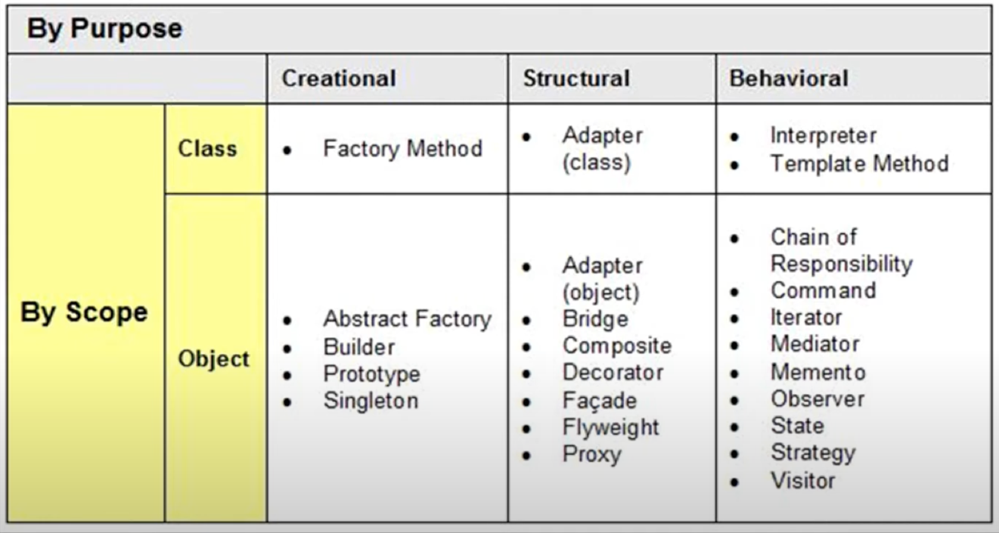

I am a firm believer in

> _"Failing to plan is planning to fail."_

By that, I mean good outcomes stem from good planning, even if it doesn't seem like it. This applies to software engineering since the whole process is essentially based on planning. There is usually, if not always, a goal in mind whilst developing software in order to make the software work, look, and interact in a certain way. Whether it is blocking out user interfaces, figuring out function logic, or outlining how clients will work with servers and databases, software engineering **depends** on plans as these highly technical implementations cannot be simply freestyled.

With enough projects, developers not only gain experience in creating software but they get _faster_ at developing too. This is because many applications possess similar functionalities but in different contexts. For example, a social media app sending notifications about a new post uses the same functionality as a banking app notifying users about unauthorized logins. Such functionalities or "problems" resolved with a common method are called **design patterns**.

## Reusing code the right way
_Design patterns_ actually stem from architecture, in which architects would repeatedly use certain designs when projects had distinct conditions to be considered (i.e., roofs in areas that receive heavy rain vs. roofs in arid places). In the context of software engineering, design patterns are pretty similar. As programmers continued to create projects, they began seeing patterns and commonalities within pieces of code that could essentially be reused for different yet similar apps. Thus, in the field of software engineering, design patterns refer to structures or designs of code that solves recurring issues or implements common functionalities in vastly different situations. 

One interpretation of software design patterns are _templates_, which I heavily resonate with as someone with experience in graphic design. Essentially, design patterns are the coding equivalent of finding some template and modifying it to satisfy certain criteria. Design patterns are typically given a **name**, **issue and solution description**, as well as **consequences**, meaning that programmers still have to think before they immediately jump to using design patterns when developing software. However, if used with diligence, design patterns in coding can significantly decrease overhead in the planning and implementation phases of deployment, yielding more time for user-testing, validation, and improvements to the codebase. Such design patterns are so useful that they have been outlined in the book refered to as [_Gang of Four_](https://www.amazon.com/Design-Patterns-Object-Oriented-Addison-Wesley-Professional-ebook/dp/B000SEIBB8) (actually titled as _Design Patterns: Elements of Reusable Object-Oriented Software_). It covers the 23 object-oriented patterns shown:

## Patterns for everyone
Some typical design patterns include the _factory_, _singleton_, and _observer_.
- **Factory** patterns are used to create objects without making the functions available to other users. It typically separates all inner workings and functions of an object creator as an interface from the object used to retrieve said object.

- **Singleton** objects are a "unique global variable" for languages that do not support global states/variables. It ensures that only a single instance of that object exists within the entire environment.

- **Observer** patterns are incredibly useful for software requiring "event handling" functionalities, like apps that need to know when updates to a database are occuring or the ability to notify users if new activity has occurred on their account. These patterns use objects called _observers_ to monitor any changes made to the state of another object called _subject_.

As of writing, I have mainly worked on two types of projects---software deployment and AI research projects. The former employs many types of design patterns that can be structural or object oriented, whereas the latter typically relies on technical, optimization-based patterns.

Within software deployment, I have encounterd observers that reflect database changes (as seen in my [Manoa Connect](https://manoa-connect.github.io/) group project) and update sites based on content accordingly (i.e., Bowfolios). Within the Manoa Connect project, many other design patterns are also used like **Hook** and **Render Props** pattern to utilize the state of a ReactJS client and render the appropriate items based on that state---like making various pages available only to users who are logged in.

In the realm of AI research projects, the design patterns are much more simple. Among existing repositories, the factory pattern is usually used to create a model that is trained with some dataset, in tandem with static/dynamic imports of modules that include relevant machine learning and neural network APIs, facilitate the training/testing of models, and help visualize model results. Though it can be argued that design patterns are less relevant in this field, it is still very fascinating how the concept itself is so useful that it is applicable in many areas where solutions are required, even outside of software development.
