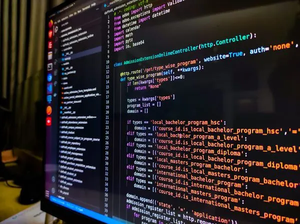
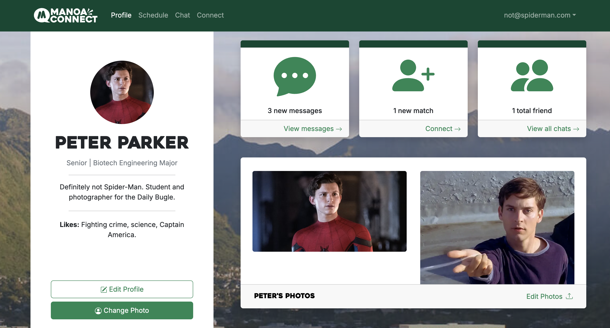

Throughout my software engineering course, my knowledge about various programming concepts and additional tools has expanded greatly. Though this was primarily learned and applied within the context of web development, such lessons will stick with me throughout the rest of my computer engineering career. Three of note include: 
- **the functional programming paradigm**, 
- **user interface frameworks**, and 
- **agile project management**. 

The reason these specific items stood out to me was because of the **_big picture_** ideas they reinforce within software engineering, which I will further explain in alongside my personal experiences with these lessons, and how I intend to implement them in the future. 

## Function over form, actually
_Functional programming (FP)_ is a style that treats functions as any other datatype, allowing it to be passed as an argument or returned form other functions. During my software engineering course, this paradigm was initially difficult to understand—especially due to my inexperience with JavaScript/TypeScript. However, additional practices and assignments later, I can appreciate the convenience and benefits FP brings. I found myself applying such concepts when mapping image links within my final project, [Manoa Connect](https://manoa-connect-now.vercel.app/). 

From my perspective, the largest draw of functional programming is generalization/parameterization, where the repetition of operations and computations is made obsolete. Functional programming instead enables the declaration of functions that accept various parameters, which can then be passed into other functions, overall reducing the need for repeated assignment statements. Examine the two types of code below, where one is implemented procedurally with assign statements, whilst the other applies functional programming.

```js
function addOne(nums) {
Let newNums = [];
For (let num of nums) {
newNums.push(num + 1);
}
	Return newNums;
}

function timesEight(nums) {
Let newNums = [];
For (let num of nums) {
newNums.push(num * 8);
}
	Return newNums;
}

console.log( addOne([ 1, 2, 3 ]) );
```

```js
function changeNum(nums, fn) {
Let newNums = [];
For (let num of nums) {
newNums.push(fn(num));
}
	Return newNums;
}

let addOne = function(num) { return num + 1; };
let timesEight = function(num) { return num * 8; };

console.log( changeNum( [1, 2, 3], timesEight ) );
```

As shown, the functional programming approach allows the code to be reused in many different contexts, whereas the procedural method requires manual tuning of assigned variables and reimplementation if to be used in slightly different ways—showing the convenience of FP. The [underscore](https://underscorejs.org/) library also provides a myriad of helpful functions that decrease the need of technical implementations for things like mapping lists, filtering sets, and more. This library (and FP in general) is very convenient in the sense that I can reach for this tool if my desired programming language allows for it, rather than have to continuously write similar code, unnecessarily repeating myself.

My main takeaway from this is the principle of **_DRY (don’t repeat yourself)_** and being ‘lazy’ in the smartest way possible. Rather than working hard and implementing repetitive code or using a specialized function over and over again, I can seek for more convenient and general methods to achieve my desired goal/outcome. This is apparent in the context of web development and coding in general, but this principle can be taken even further into the realm of problem-solving and critical thinking. A lot of answers typically focus solely on a single problem but are not suited for scalability and the concepts taught through functional programming (DRY, generalization, parameterization, etc.) can remedy that. Thus, the practicality of functional programming is the main reason it stood out to me.

## Reframing thoughts on frameworks
Being honest, I was not initially receptive to user interface frameworks (UI frameworks) because I held a semblance of pride towards fine-tuning a website’s layout and aesthetics manually via cascading style sheets (CSS). _UI frameworks_ consist of existing libraries, tools, and classes, altogether streamlining the process of developing web application layouts. 

Once I let go of my ego and gained more hands-on practice with UI frameworks, namely [ReactJS](https://react.dev/), I began to understand its various benefits and how to still retain some fine customization capabilities. Specifically, I learned how frameworks and templates are essential in a real-world development environment as they allow for quick prototyping and fast feature testing without programmers being bogged down with writing boilerplate code. This combined with cascading style sheets allow for rapid development with a decent amount of personalization. Moreover, UI frameworks can provide additional structure to projects and inherently provide cohesion for an entire project. Certain frameworks like React Bootstrap are especially helpful in simplifying the spatial layout of an application.

A fantastic example demonstrating this shortened development time is a project where I (_somewhat_) accurately recreated the homepage aesthetics (pictured top) of an existing website (pictured bottom) within a single day. Though it did not have all the technical functionality, I believe that recreating the aesthetics of a fleshed out homepage in a short timeframe exemplifies how UI frameworks directly facilitate the web development process.

<div class='row align-items-start'>
  <div class='col'>
    
  </div>

  <div class='col'>
    
  </div>
</div>

In addition to using React Bootstrap, I was able to fine-tune certain visual aspects of the website by employing CSS code in each React element, allowing me to have the best of both worlds. Beyond web development, UI frameworks—or frameworks in general—are crucial to any development process. Where functional programming showed me that using new tools for their practicality is essential, UI frameworks taught me how to balance the convenience of framework with the specificity of manually implemented code. Hence, I will continue to keep this in mind in the future for any project/employment experience I pursue, viewing frameworks as a facilitator rather than an outright replacement for handwritten code.

## Fail fast, improve faster
Last but not least is the _agile development process_ and project management. The agile process refers to an iterative and incremental development cycle that is focused on fast planning, designing, implementation and testing in hopes for a quick project completion/release. Core values of an agile project is the flexibility and collaborative nature of the developers working on it, and most importantly: incremental improvements. 

Funny enough, my software engineering class was not the only course this semester that emphasized an agile methodology. However, it was much more involved in the sense that our final project entirely relied on agile management—specifically _issue driven project management_—and close collaboration on a team of programmers all implementing some sort of code. This style of agile management required the creation of a project board and issues using [GitHub](https://github.com/). Each issue contained a task, some time estimates, and person/people the issue was assigned to. This meant that each team member was entirely responsible for a certain area of the project and were expected to be diligently working on their part. 

Through this experience, I found myself to be very productive and the project to be developing at a rapid pace alongside my skills. I went from being shaky with React elements, object relational mapping using Prisma, and Vercel deployment to seamlessly building, testing, debugging, and eventually launching the side. Within the span of 3-4 weeks, my team and I were able to produce a generally functional output ready for desktop users, with the [Manoa Connect](https://manoa-connect-now.vercel.app/) having most of the features we intended it to (profiles, picture uploading functionality, chats, matching function, personal schedules).

<div class='row align-items-start'>
  <div class='col'>
    
  </div>

  <div class='col'>
    
  </div>

  <div class='col'>
    
  </div>
</div>

Agile project management is easily one of the most impactful concepts I have been introduced to in this class as it is clearly applicable to any project in general. The ability to quickly send out a prototype, figuring out issues to be resolved and improvements to be made, applying it, then re-releasing the product is a surefire way of producing both successfully and in a timely manner. 

The prevalence of agile project management also reflects the shift in engineering culture where companies are now seeking to bring software to life as fast as possible and quickly improve it to a quality state instead of spending time fully refining the project. This is likely due to the increasingly fast pace of the digital era in which continuously refining a project for a long period of time to no fanfare/unsuccessful launch becomes costly in both money and time. Therefore, iteratively improving upon a design at a cheaper overhead ensures that developers hone their product to the needs of users while having an existing customer base on official launch.

## Onwards and upwards
Altogether, these three concepts of software engineering were the most thought-provoking and impactful. Not only do functional programming, UI frameworks, and agile project management provide a glimpse into a practical software development environment but they yield overarching ideas to be applied as a software engineer. From using all available tools at my disposal, practicing discipline when combining/working with pre-established resources, or smart project management abilities, I can confidently remark that software development is much more than just technical prowess or coding capabilities—it is a role where you are continuously improving, learning, and optimizing products not just to practice programming skills but to ensure a quality product that satisfies the need of companies and users alike.
