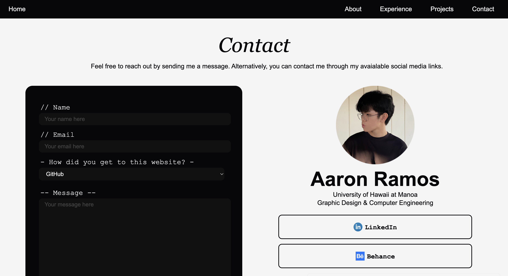

My first experience coding a website was strictly using HTML and CSS. Specifically, I was creating a portfolio to be used on a professional basis. It would be quick and easy: make a design, add a few pages, and simply launch using GitHub as the host. 

At least I **_thought_** it would be quick and easy. Instead, this endeavor began with me figuring out HTML and CSS syntax. Then it led to me learning about grids, margins, and padding. The few quick hours I sought to spend on this portfolio quickly became days. During those days, I thought of new ideas to make the portfolio more interactive---which took me a week or so to implement from scratch. By the time I finished the main content of the portfolio, the first two weeks of 2025 had already passed---**when I meant to finish it within the first two weeks of December 2024.** Those countless hours culminated in this [portfolio](https://aar0m.github.io/personal/), something I am still somewhat proud of to this day. Here is a little peek:

Though I am content with the final product, I wish I had learned about user interface (UI) frameworks before even thinking about starting a website. At least with a framework, I could have saved time on a general layout and fine-tune it later using raw HTML/CSS.

## UI Frameworks vs. Raw HTML/CSS
UI Frameworks are handy tools for website developers to use when generating a website. It can possess various features depending on the framework used but they all focus on expediting the website creation process. For example, some frameworks possess classes that dictate styles and spacing properties of HTML elements that would normally be written in a separate CSS file, reducing the need to constantly switch between an HTML and CSS file. This framework also alleviates the pain of tracking how elements are styled and figuring out what to change. Whether it is using **ReactJS** to optimize program speeds or **Bootstrap 5** for a quick and easy layout, I consider UI frameworks a 'must-use' in the world of web development. This is also based on personal experience from building a website using strictly HTML/CSS and building one primarily through Bootstrap 5.

Whilst building my personal portfolio website with HTML/CSS, I deeply struggled understanding certain spacing concepts, features, and the correct perspective of displaying content. It took me a couple tutorials to completely understand dividers and the syntax of different elements. It took even more to understand that having a plan/reference for how content is displayed is the key to efficiently creating websites. A personal frustration I have with HTML/CSS web development is its steep, (somewhat) unintuitive learning curve---lots of hidden features, rules, and properties that one may need to find and learn on a case-by-case basis. Even now, I am sure that there are tons of HTML/CSS properties I am completely unaware of. However, some benefits of HTML/CSS is the freedom and fine-tune control it provides. Though the learning curve is steep, understanding some basics allows developers to create whatever they want exactly the way they want it. Through some frustrating labor, time commitments, and strenuous effort, one can design a website fitting their specific vision.

That being said, the benefits of UI frameworks works almost complementary to strict HTML/CSS. UI frameworks like ReactJS and Bootstrap have more intuitive syntax and workflows, yet feel limited in their fine-tune control. An example to highlight this is recreating the [Shopify Rebellion Homepage](https://shopifyrebellion.gg/). This was a personal project to simply understand the benefits of UI frameworks and become accustomed to Bootstrap syntax. Admittedly, my experience with Bootstrap may have been facilitated through a better understanding of HTML and CSS, but its benefits are applicable to web developers in general. Bootstrap allows developers to specify certain style properties, which are normally dictated in a separate file, within the HTML element itself through various classes. This method of styling allows for websites to be quickly generated as minimal switching of files has to occur and editing style properties of specific elements becomes much more convenient. Moreover, Bootstrap 5 contains understandable classes for certain layouts, such as containers, columns, and rows! With all these features, UI frameworks seem to be much better than raw HTML/CSS. To emphasize this point, [my recreation](https://github.com/aar0m/shopifyrebel-bootsrap) (left) of the official Shopify Rebellion Homepage (right) is almost indistinguishable! Even better is that this recreation only took me a **day** compared to the **weeks** I spent on my personal portfolio. Thus, UI frameworks can explicitly save time AND effort during the website creation process.

  

  

It is important to note that there are noticeable differences in the websites if examined closely. This is mainly due to the disadvantage of UI frameworks, in which certain styles and properties are "preset", meaning that fine-tune customization options are not necessarily at the forefront of the web-development experience.

## Why not both?
As mentioned, both HTML/CSS and UI frameworks have their own sets of advantages and disadvantages. These sets of pains/gains are very much complementary in nature, which makes sense. HTML/CSS are the foundational languages for the website creation process, a process that UI frameworks, like Bootstrap, improve upon. Though UI frameworks appear to be superior in many ways, it cannot overcome the hurdle of limited customization. To further explain, there is a **certain extent** to which UI frameworks can be used---one can personally customize certain parts of the framework to fit their liking, but it will not be applicable to the rest of the website, making the customization feel pointless.

In consideration of this, the question no longer becomes _"Why should I bother using HTML/CSS when I have UI frameworks"_ to _"How can I efficiently develop websites that fit my vision with HTML/CSS **_and_** UI frameworks?"_

The answer to this question is fairly straightforward. By leveraging the strengths and weaknesses of each method, it becomes apparent that using UI frameworks for a quick _"sketch"_ of the website (i.e., spacial formatting, content to be displayed, features, etc.), while HTML/CSS can be used to completely _"draw the details"_ of the website is the most optimal way of incorporating both methods. The accessibility and intuitive design brought by UI frameworks are phenomenal in the context of letting developers generate a website in a timely fashion, while spending a little more time to adjust details/implementation so that they are _just right_ is reflective of the HTML/CSS styling process. This way, one can retain that fine-tune control for their website design yet save tons of time and effort laying down basic foundational aspects of the website. So when developing a website, remember that **UI frameworks to make the** _(website)_ **frame work and CSS to pretty up the excess** _(elements of the website)_.