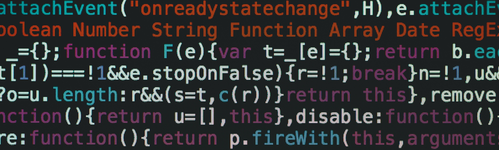

Reading code is difficult---for many different reasons. In my personal experience, proudly parading my code to non-programmer friends always generates noises of awe, disgust, confusion, apathy, or some morbid combination. On the other hand, casually showing my code to programmer friends always magically leads into a code review session. Though, I cannot say much because I am also guilty of impromptu code reviews. In both cases, reading the code normally starts out difficult. For non-technical people, it is because they see a jumble of letters and symbols that _feel smart_. For programmers, they need to figure out the structure of the code, distinguish originally written code from boilerplate code, and clearly understand what the program is actually trying to accomplish.

**However**, coding standards are a sure-fire way of soothing the painful beginnings of reading code. It may be a hassle to establish and reinforce, but abiding by a set of coding standards are more likely to boost productivity, facilitate code reviews, and make code just more appealing to look at.

## Stylish AND practical
Generally, coding standards are a set of rules and general principles that a programmer follows when writing code. This can include a myriad of guidelines relating to whitespace, naming conventions, function declaration, and general code structure. 

Initially, this may seem like a trivial and tedious proposition due. Of course, coding standards have an inherently _aesthetic_ property. However, coding standards are just as practical and functional as they are to look at---it is surprising what neatly written code can do for productivity. Through the implementation of coding standards, peers can take a look at a single block of code and immediately understand the format. This allows them to _"get a feel"_ of the code format and subsequently lets them efficiently scan through the rest of the program. This can aid in debugging by making errors more apparent when they are present as other programmers will have to spend less time processing how the code is formatted and understanding its basic function. To further prove this point, examine the following code:

```ts
type Lyrics = string[];
function numLike(lyrics: Lyrics): number {
  return lyrics.map(line => line.toLowerCase().split('like').length - 1).reduce((acc, curr) => acc + curr, 0);
}
```

At a glance, it is difficult to understand that this code counts the number of times that the word 'like' appears within some input. Strangers to this program would have to spend additional time sorting out the methods being called on the input due to its functional programming approach. However, using a functional programming approach is preferred due to its efficiency. One might ask, "Is there a way to make this code more understandable?" Thus, this demonstrates the need for organization---more specifically---coding standards. By using an arbitrary coding standard, the output can become much easier to read. For example, we rewrite the array methods within the function and include documentation:

```ts
type Lyrics = string[];

// Returns the number of times the word 'like' appears in the input (lyrics)
function numLike(lyrics: Lyrics): number {
  return lyrics
    .map(line => line.toLowerCase().split('like').length - 1) // converts each line to lowercase and splits at any occurrence of 'like'
    .reduce((acc, curr) => acc + curr, 0);                    // counts # of 'like's
}
```

This code feels much better and easier to read at a glance, clearly distinguishing the functional methods applied to the input in a readable way. Such a clean implementation means there is a way to stay efficient in both writing and reviewing code. Additionally, documentation (which may or may not be considered a part of coding standards) is added so that peers can understand the code without the presence of the original programmer that wrote it. For these reasons, it becomes increasingly apparent why coding standards matter.

## Raising my standards
Once understanding the importance of coding standards---and hopefully wanting to use them---it is important to determine what kind of coding standards should be followed and understand some pitfalls. From my personal experience, any type of coding standard is helpful. Whether it is simply adding specific whitespace or having a detailed reference of how every line should be written under specific circumstances, a form of unified standards is a fantastic start to regularly using coding standards. Some companies even have a defined style guide of how to write code, showing that coding standards are a tangible, real-world practice that yields certain benefits.

Personally, I enjoy breaking up methods similar to the provided example and apply it whenever possible. Another standard I follow is adding a new line when displaying an array of strings or any content in a container that spans more than a few spaces. This lets me quickly observe the contents without having to account for commands and defining where items are separated---this is more for string arrays but can be applied in general. Another feature I have been recently introduced to (at the time of writing) is **ESLint**. This program, installed as an extension on my Visual Studio Code integrated development environment (IDE), essentially reinforces a customizable coding standard tailored towards JavaScript/TypeScript. It has been really convenient in terms of ensuring I follow proper coding conventions, allowing all the code I have written to be very accessible. Moreover, I recommend installing **ErrorLens**, if available, to display error messages within the IDE instead of having to hover over possible errors. Together, these tools really keep me on track to write properly formatted code.

Documentation is also an important aspect. It is a powerful tool that lets programmers speak with others without being physically present or actively messaging them. I am a firm believer in documentation but recognize that there is such a thing as _over-documentation_, where a programming writes more comments than code. I have been guilty of this before and have luckily grown out of it through various code reviews and simply more practice programming. Good documentation should be concise yet relatively competent at explaining functionalities.

Altogether, the importance of code standards and its various benefits have been established. Moreover, its practicality and my personal experience with them help show that coding standards are not a binary set of rules that are right or wrong, rather an extra tool to consider using to facilitate reading code. From the example given and having experienced the effects of reading code that properly implements standards, the importance and benefits of coding standards are demonstrated to be very real and practically applicable in a real-world setting. Hence, to make reading code less difficult, **write using coding standards.**