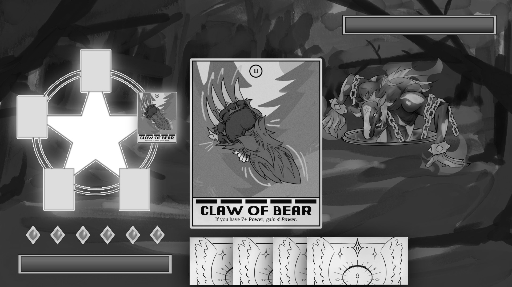
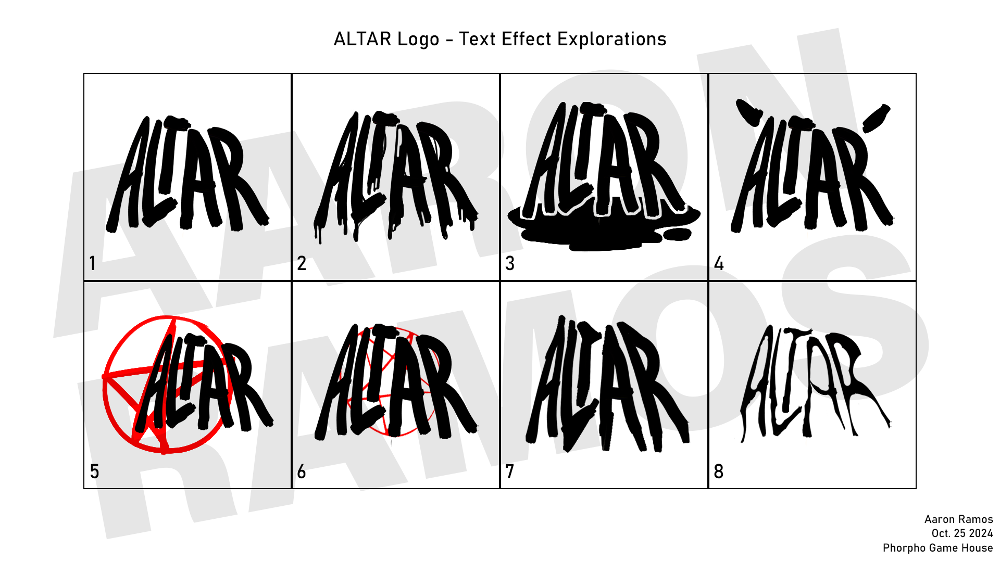
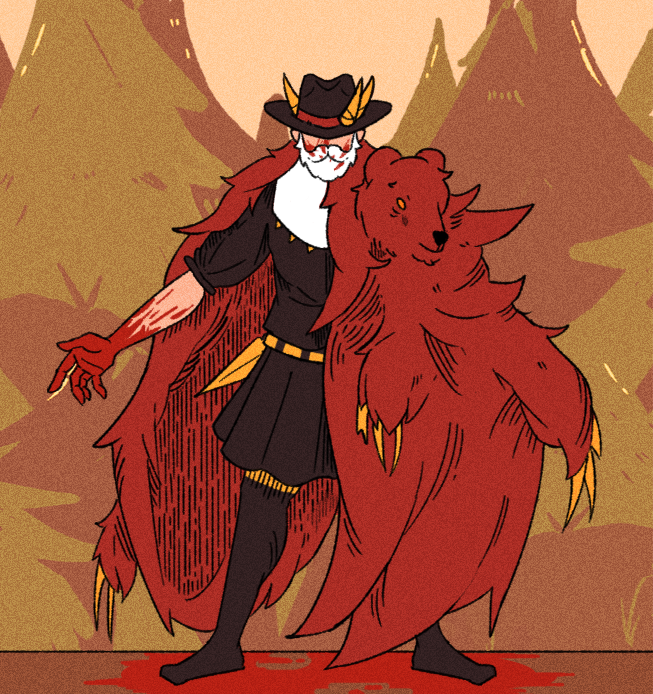

## Gameplay
Altar is a _roguelike deckbuilding game_ that is set during the 14th century. The general gameplay loop of Altar is building a deck of cards to use as a means of defeating demons. During battle, cards can be placed onto a pentagram, in which card effects can be chained together to perform interesting combos or directly deal damage to the demons until they have no remaining health left. In between battles, the player is presented with additional cards they can purchase to add to their deck. This is the main premise of our game.

## Contributions
As of right now, Altar is still in development but I have been hard at work as a digital illustrator and graphic designer. Under these roles, I have been able to create concept art for cards, design tentative logos, and draft mob designs that will be implemented into the game. 

## Skills!
Additionally, this project has taught me how to effectively communicate with others and establish a style of collaboration that can be applied to the real world. Technical skills I practice within this project include digital illustration, designing mockups, and developing UI elements.

The following are some card designs and logo concepts I created for Altar.

