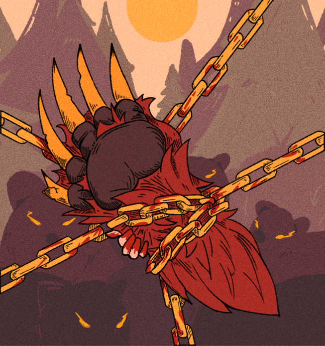
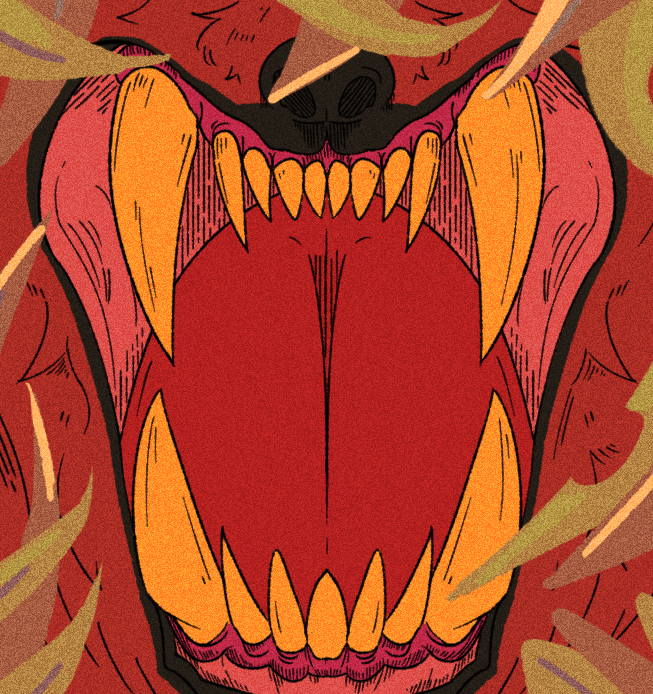

Altar is a _rogue-like deck-building game_ that is set during the 14th century. The general gameplay loop of Altar is building a deck of cards to use as a means of defeating demons. During battle, cards can be placed onto a pentagram, in which card effects can be chained together to perform interesting combos or directly deal damage to the demons until they have no remaining health left. In between battles, the player is presented with additional cards they can purchase to add to their deck. This is the main premise of our game. The following image is a mockup completed in collaboration with a fellow artist.

## Tools and Contributions
The game is to be built using [_Godot_](https://godotengine.org/), an open-source game engine. GitHub is the main host for the codebase. As of right now, Altar is still in development but I have been hard at work as a digital illustrator and graphic designer. Under these roles, I have been able to create concept art for cards, design tentative logos, and draft mob designs that will be implemented into the game.

## Design Philosophy
In consideration of the setting and premise of the game---a deck-building game, I believe the card art and aesthetic to play a big role for user enjoyment. This means the art direction must fit the lore developed for the game and be thematically relevant. Due to the dated time period and high focus on cards, I assumed tarot cards would be a fitting approach that allows me to retain creative freedom with the style of the cards.

An interesting challenge I encountered was finding the correct balance between realism and a stylized art style. It would be too taxing on the small art team to create realistic art that is fully rendered for a large number of cards, but leaning too heavily towards traditional tarot card style would restrict creative expression. Instead, I merged the two to develop a realism-inspired art style that mainly implements the stylized tarot hatching for the shading, while painting the background/foreground aspects with no line art. The result is a vibrant and focused piece that draws the player's attention to the shaded details while still providing an aesthetically pleasing and recognizable "bigger picture" to look at, even from afar. These cards are designs made using this philosophy and from the 'Bear Set' with its own unique card mechanics, hence the unified color palette. It can be seen that the content of the art is an illustration but _"taro-eqsue"_, fitting well into the grim, gothic 14th century aesthetic.

  

    
  

  

    
  

  

    
  

  

    
  

## Skills
This project has taught me how to effectively communicate with others and establish a style of collaboration that can be applied to the real world. Moreover, I practice technical skills, including digital illustration, UI design, and art direction development. Since this is a group project among hobbyists, it is not a major time commitment but a work of passion where I am allowed to fully embrace the role of a creative with little-to-no stress about programming or coding. Though I love being able to flex my programming muscles, I also feel that it is important to indulge in creative passions that foster innovative thought processes and personal satisfaction.

The following are logo concepts I created for Altar.

