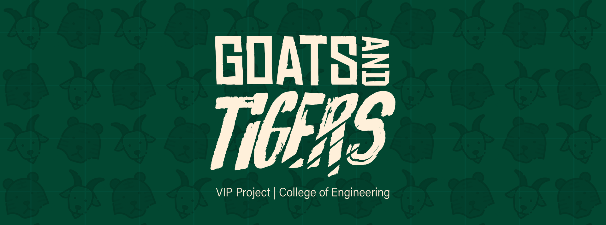
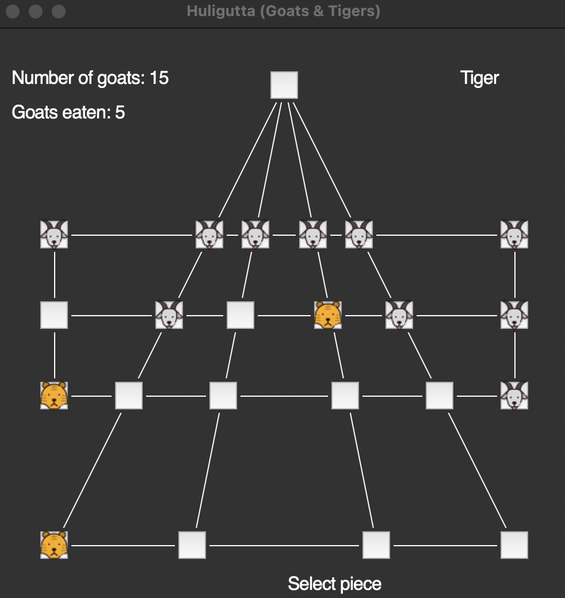

"Goats and Tigers" or _Huligutta_ is a turn-based game that pits two players against each other on a uniquely shaped map consisting of empty nodes. Similar to chess, each player takes control of a piece (Goat or Tiger) and must achieve a piece-specific win condition based on their available move set. Three Tiger pieces exist on the board before the game starts and can be moved immediately, whereas 15 Goat pieces must be placed on the board before each individual piece can be moved. Both pieces can only move to adjacent nodes. 

### Win conditions
Tigers win by **capturing** 6 Goats, a move where Tigers remove Goat pieces from play. Capturing is only possible when the Tiger is next to a Goat and the Goat has an empty space behind it. Goats win by **stalemating** all 3 Tigers. This is achieved by having Goats surround all 3 Tigers in a manner that prevents Tigers from making any movements or captures.

## Purpose
The main purpose of this game is to function as a prototype/proof-of-concept for more practical uses. Specifically, this implementation of a player model that can successfully win as the Goat player attempts to exhibit critical decision-making capabilities driven by reinforcement learning (RL). _Reinforcement learning_ refers to the training desired behaviors within an agent by providing rewards for making "correct" decisions and punishing "bad" decisions that are arbitrarily determined by the trainer. By leveraging RL and _deep neural networks_, a machine learning algorithm (neural network) that transforms data through hidden layers between an input and output, our team has successfully implemented a Goat player model that can win 95% of the time against a _greedy tiger strategy_ (i.e., an algorithm where Tiger pieces eat Goat pieces whenever possible).

Since this was achieved, the project is now being developed further into three new projects: one to expand the current game capabilities, another to successfully perform weather forecasting, and another to predict energy consumption.
1. **Game Expansion** - This project involves the implementation of machine learning libraries (i.e. OpenSpiel) to increase current Goat player capabilities. At the moment, we implement a two-step lookahead where the Goat player model predicts two steps into the future by considering all possible moves while using value iteration on the state of the game. This then allows the Goat model to make choices leading to game states with higher values (winning game states). Moreover, this is only against a **greedy tiger strategy**. Through machine learning libraries, we intend to make the Goat model adaptive to any kind of Tiger strategy, in addition to a deeper prediction ability, such that the Goat model can envision decision paths leading to a game win from an initial position instead of incrementally looking ahead by two turns until it wins.

2. **Weather Forecasting** - We can implement RL as an overarching framework to train a large language model (LLMs) that takes weather data as inputs and uses its features to forecast the possible weather in different areas. The main idea is that, akin to chatbot LLMs that tokenize language and words to develop a contextual understanding of a statement being entered, we can perform a similar tokenization of weather data to find a contextual understanding of the weather occurring in a certain area.

3. **Energy Consumption Security** - Similarly, RL can be used to reward a continual learning model for correctly predicting energy consumption. The UH Manoa campus aims to possess net-zero energy by 2035, meaning that the university offsets their energy consumption by producing the same amount of energy via sustainable and renewable means. This extension of the Huligutta project seeks to contribute by training a model capable of predicting the required energy for certain buildings within the campus. However, the main issue is the existence of malicious/corrupted data that may hinder the model's prediction capabilities. Thus, we seek to develop a way to reward this model for distinguishing honest energy consumption anomalies (like blackouts, holidays, etc.) with malignant data inputs. 

Altogether, these branches all stem from the Huligutta project. The game prototype has served as a functional foundation for the reinforcement learning framework applied in more practical settings, while providing students with an introduction to the mechanics of machine learning.

## Tools and Contributions
The main tools used in this project include Python for writing code and using machine learning libraries, GitHub for project management, Discord to communicate with team members, and the university's computing cluster (KOA) for model training. The main reason we use KOA instead of local machines to train our models is because KOA possesses GPUs that speed up the training time. I am a programmer for this project, responsible for refactoring the game (originally implemented in Python) so that it is compatible with the RL libraries and environments so new models can be trained. Additionally, I am a mentor for new students taking up the class, responsible for catching them up to speed. So far, this project has allowed me to exercise my skills in Python, review foundational concepts in machine learning, neural networks, and probability, while building up my ability to implement projects using existing libraries. This project also requires a certain level of time commitment to attend weekly meetings and perform research outside of meeting hours.

This code simply instantiates the game and specifies the parameters required so it can interface with the OpenSpiel library.

```python
from open_spiel.python.observation import IIGObserverForPublicInfoGame
import pyspiel

_NUM_PLAYERS = 2
_NUM_ROWS = 5
_NUM_COLS = 6
_NUM_CELLS = _NUM_ROWS * _NUM_COLS
_GAME_TYPE = pyspiel.GameType(
    short_name="tigersandgoats",
    long_name="Python Goats and Tigers",
    dynamics=pyspiel.GameType.Dynamics.SEQUENTIAL,
    chance_mode=pyspiel.GameType.ChanceMode.DETERMINISTIC,
    information=pyspiel.GameType.Information.PERFECT_INFORMATION,
    utility=pyspiel.GameType.Utility.ZERO_SUM,
    reward_model=pyspiel.GameType.RewardModel.TERMINAL,
    max_num_players=_NUM_PLAYERS,
    min_num_players=_NUM_PLAYERS,
    provides_information_state_string=True,
    provides_information_state_tensor=False,
    provides_observation_string=True,
    provides_observation_tensor=True,
    parameter_specification={})
```

You can learn more at the [UH Vertically Integrated Projects (VIP) Website](https://manoa.hawaii.edu/uh-vip/project/asig/) and view a version of the [GitHub repository](https://github.com/nsanthan/tigersandgoats).