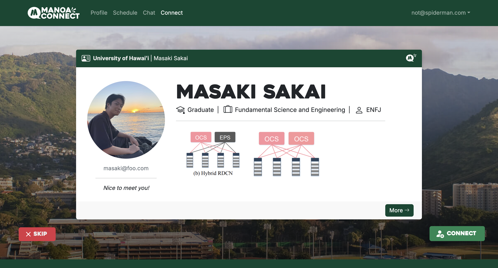
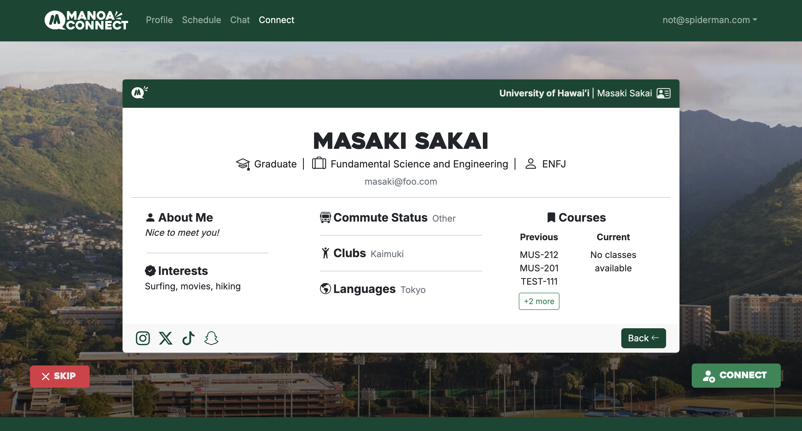
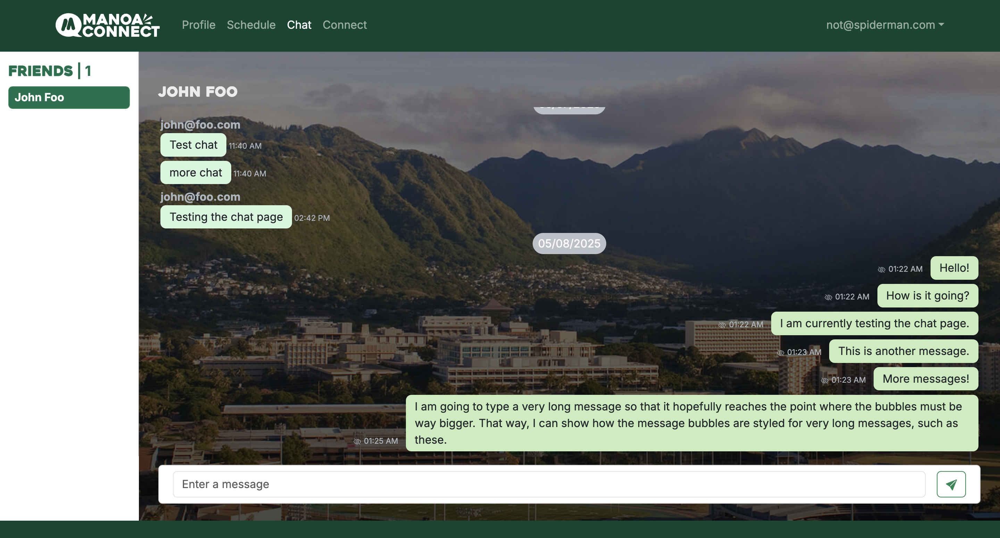

## Relevant Links
- [GitHub](https://github.com/manoa-connect)
- [Deployed Application](https://manoa-connect-now.vercel.app/)

## Purpose
Manoa Connect, a social networking website that applies matching functionalities reminiscent of dating apps (Tinder, Hinge, etc.), was built to facilitate student connection on the UH Manoa campus. It is understandable some students have difficulty being in a foreign environment (i.e. incoming freshmen, sophomores, exchange students) or difficulty breaking into established social groups (i.e. juniors/seniors). Additionally, some students lack time to commit to social events and may be socially inexperience/have an introverted nature. Moreover, the quarantine enforced during the pandemic may have shifted cultural norms on offline socialization (i.e. people may prefer socializing online more now).

By creating a thriving social platform distinct to members of UH Manoa (specifically students), we hope students can:
- Develop friendships with people from different majors at UH Manoa to learn new perspectives
- Find new career/networking opportunities by connecting with students in different fields of study
- Learn how to socialize with people who have unique backgrounds, gaining social skills applicable throughout life

Manoa Connect is designed, implemented, and maintained by Codie Nakamura, Chaezen-Lee Pebria, Masaki Sakai, and myself, Aaron Ramos.

## Design
The main design for the website includes the _profile_, _match_, and _chat_. There are also additional pages to upload pictures and add a school schedule for increased personalization capabilities, as well as to localize the web app for the UH Manoa campus.

For new users, the website prompts them to create a new account and profile with relevant information they would like to share with possible connections. They are then brought to their profile page, which allows them to further personalize their profile through pictures and a schedule. Once they are ready, they can navigate to the 'match' page and view other profiles, corresponding information, and choose to skip/connect with them. If two users connect with each other, they are allowed to chat with each other, as seen in the chat page.

  

    

      
    

    

      
    

  

  

    

      
    

    

      
    

  

  

## Contributions
Initially, my main roles in Manoa Connect were as Project Manager and _Gopher_, meaning that I was mainly in charge of providing members their role, helping them resolve any issues possible, and organizing meetings to make sure that progress was being made throughout the development timeline. However, I found myself also working on the graphic design, deployment, and documentation of the project over the course of the semester.

Not only did I handle the code for creating a profile, but I also implemented the layout for the initial profile page and the image upload functionality, as well as refining the layout/aesthetics of all other pages before ultimately aggregating all relevant branches and deploying it live on Vercel.

## Skills
Through this project, I learned a lot about agile project management, the ReactJS framework, Supabase storage options, object relation mapping (ORM) via Prisma, and live web deployment with Vercel. This was also a good exercise in planning for a project with the utilization of Unified Modeling Language (UML) diagrams, basic sketches of site layouts, and documentation of desired features/functions.

Specifically, I learned Issue Driven Project Management, where members create issues with a time estimate, general list of tasks they seek to complete within a branch, and an assigned member. This kept the group organized and tracked the development of each feature on separate branches, with the main challenge stemming from merging all these branches while preserving the functionality.

In terms of the ReactJS framework, Prisma ORM, and UI framework React Bootstrap, I learned how to create distinct database objects that could be altered through website forms once a database and host client are linked. Regarding the implementation of Supabase and Vercel, I learned how to deploy web apps and transfer their environment variables, building and debugging applications before sending an application to production, as well as making use of bucket storage options.
