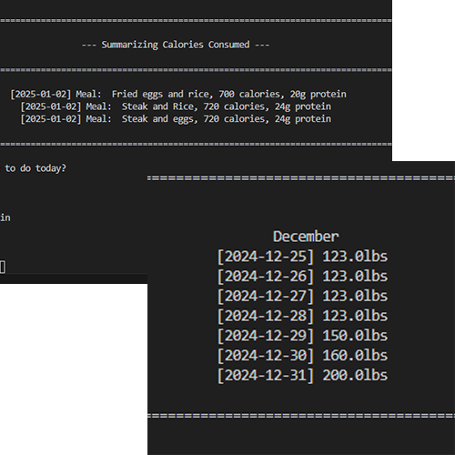

## Application functionality
This simple Python application allows users to track their weight and the calories they consume over time. Specifically, users are given options to log or view certain items; one of which is weight that the user measured themselves. The other item is the food the user consumes. This program queries the estimated calories (kCal) and protein (g) consumed per meal. For snack items, users can instead input the amount of servings consumed and the nutritional facts for one serving, while the program automatically calculates the total calories and proteins consumed. Another capability of this function is the ability to view user weight and meal over varying time periods (e.g., weeks, months, year). Data is stored on _.csv files_ based on months within a year.

## Contributions
Since this is a personal project, I implemented most functions. However, it is important to note that I used a tutorial for a Python finance tracker as a base then independently branching out for more niche capabilities (like search functions).

## Skills!
Through this project, I exercise fundamental skills of Python, reiterate version control on GitHub and attempt practices of software testing, debugging and overall maintenance. This includes attempting to break the program, fixing found bugs, and writing detailed, yet understandable documentation for the program.

Here is an excerpt from the program that saves the logged calories:

```python
def save(food, cal_file_path):
    fr.prMethodHead(f"Recorded {food} to {str(cal_file_path).split('/')[3]}!")

    with open(cal_file_path, "a") as f:
        if isinstance(food, Meal):
            f.write(f"{datetime.date.today()}; M; {food.desc};{food.cal};{food.protein}\n")

        elif isinstance(food, Snack):
            f.write(f"{datetime.date.today()}; S; {food.name};{food.servings};{food.cal};{food.protein}\n")
    f.close()
```

You can learn more about the program (and try it yourself) through its [GitHub repository](https://github.com/aar0m/weight-tracker).